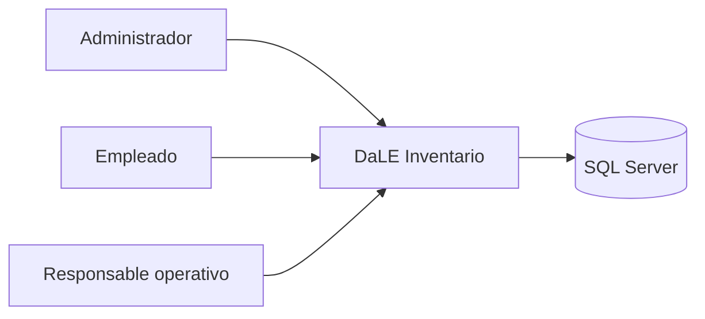
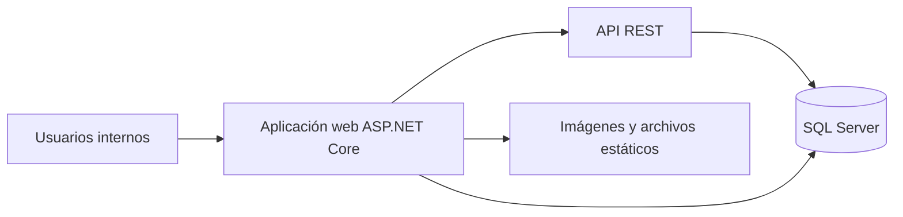
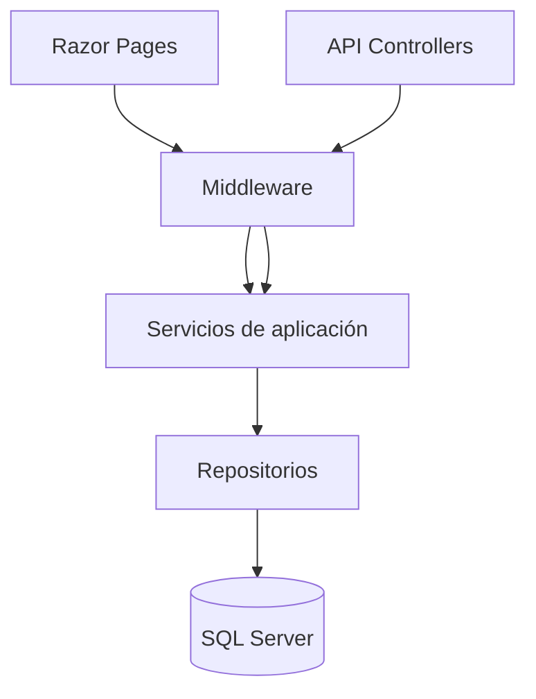

# Arquitectura C4 - Resumen ejecutivo

## Propósito del sistema

DaLE significa `Dashboard de Logística e Existencias`.

DaLE Inventario es una plataforma interna para controlar productos, registrar ventas, vigilar stock bajo y apoyar decisiones operativas mediante reportes y trazabilidad.

Su objetivo es reducir errores manuales, mejorar el seguimiento del inventario y dar una base clara para crecer el sistema sin perder control técnico.

## Vista general 

El sistema tiene tres piezas principales:

- una aplicación web que usan administradores y empleados
- una API que permite integrar o probar funciones de forma técnica
- una base de datos donde se guarda toda la información del negocio

Además, el sistema usa almacenamiento local para imágenes del catálogo y genera reportes PDF para operación y seguimiento.

## Quiénes usan el sistema

- `Administrador`
  - administra productos, categorías, usuarios, auditoría y reportes
- `Empleado`
  - consulta productos y registra ventas
- `Responsable operativo`
  - revisa reportes, stock bajo y documentos PDF

## Resumen C4 por niveles

## Diagramas visuales

- `diagramas-c4/contexto.svg`
- `diagramas-c4/contenedores.svg`
- `diagramas-c4/componentes.svg`

## Nivel 1 - Contexto

En este nivel se responde una pregunta sencilla: ¿quién usa el sistema y con qué se conecta?

- los usuarios internos entran desde el navegador
- la aplicación centraliza la operación de inventario
- la base de datos conserva productos, ventas, usuarios y trazabilidad

## Nivel 2 - Contenedores

En este nivel se explica cómo está dividido el sistema por bloques grandes.

- `Aplicación web ASP.NET Core`
  - contiene la interfaz visual, la API, Swagger, autenticación y seguridad HTTP
- `SQL Server`
  - almacena toda la información de negocio y seguridad
- `Archivos estáticos`
  - guardan imágenes del catálogo y recursos visuales

## Nivel 3 - Componentes

En este nivel se explica cómo se organiza el sistema internamente.

- `Razor Pages`
  - pantallas para login, productos, ventas, reportes, categorías y usuarios
- `Controllers API`
  - endpoints para autenticación, productos, ventas, reportes y usuarios
- `Services`
  - aplican reglas del negocio
- `Repositories`
  - consultan y guardan información
- `Middleware`
  - controlan errores, seguridad, trazabilidad e idempotencia

## Decisiones técnicas que vale la pena entender

- **Separar el sistema por capas**  
  Facilita mantenimiento, pruebas y crecimiento.

- **Usar Razor Pages para la UI interna**  
  Permite construir un backoffice rápido y ordenado.

- **Exponer API REST**  
  Hace posible probar y reutilizar el sistema desde integraciones.

- **Usar JWT en API y cookies en web**  
  Cada canal usa la autenticación que mejor le encaja.

- **Usar EF Core con SQL Server**  
  Simplifica persistencia y migraciones.

- **Manejo global de excepciones**  
  Evita errores desordenados y mejora trazabilidad.

- **Roles y políticas de autorización**  
  Protege pantallas y endpoints reales, no solo menús.

## Beneficios para negocio

- más control sobre inventario y ventas
- menor riesgo de errores manuales
- mejor seguimiento de productos críticos
- capacidad de auditoría para revisar acciones importantes
- base técnica preparada para seguir creciendo

## Conclusión

La arquitectura actual está bien planteada para una solución interna sólida. Responde adecuadamente a las necesidades del día a día, incorporando aspectos clave como seguridad, trazabilidad y facilidad de mantenimiento. Además, deja una base lo suficientemente flexible como para crecer y adaptarse en el tiempo, sin necesidad de rehacer el sistema desde cero.
