# Arquitectura C4 de DaLE Inventario

Este documento describe la arquitectura del sistema usando el enfoque C4. La idea es explicar el sistema desde lo más general hasta lo más cercano al código, con un lenguaje claro y útil para personas técnicas y no técnicas.

En esta solución, `DaLE` significa `Dashboard de Logística e Existencias`.

## Diagramas visuales listos para entrega

- `diagramas-c4/contexto.svg`
- `diagramas-c4/contenedores.svg`
- `diagramas-c4/componentes.svg`
- `diagramas-c4/aplicacion.svg`
- `diagramas-c4/infraestructura.svg`
- `diagramas-c4/flujo-venta.svg`
- `diagramas-c4/flujo-pdf.svg`

## 1. Nivel 1 - Contexto

DALE Inventario es un sistema interno para controlar productos, ventas, alertas de stock bajo, usuarios y reportes operativos.

### Actores principales

- `Administrador`: gestiona productos, categorías, usuarios, auditoría y exportaciones.
- `Empleado`: consulta productos, revisa detalle y registra ventas.
- `Responsable operativo`: consume reportes y solicitudes de compra en PDF.

### Sistemas externos o dependencias

- `SQL Server`: almacena datos de negocio, usuarios, trazabilidad y auditoría.
- `Navegador web`: interfaz usada por administradores y empleados.
- `Swagger/OpenAPI`: interfaz técnica para probar la API REST.
- `Docker`: apoyo para levantar SQL Server localmente.

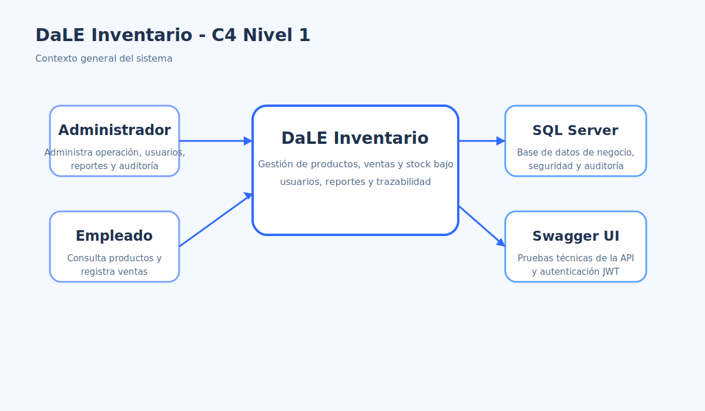

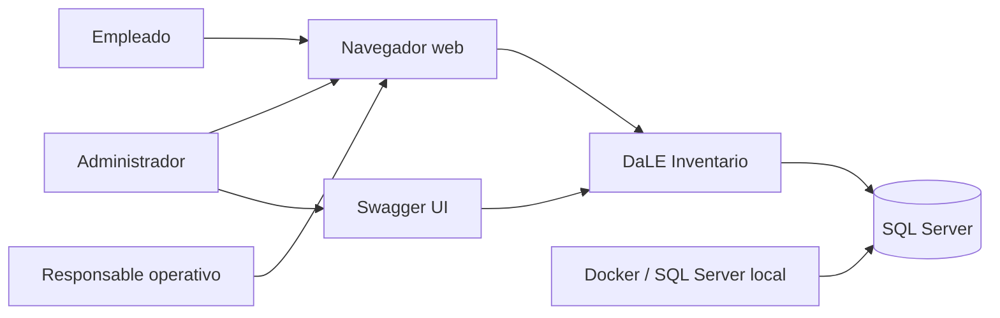

## 2. Nivel 2 - Contenedores

La solución está desplegada como una aplicación ASP.NET Core que combina interfaz web y API, apoyada por una base de datos SQL Server.

### Contenedores

- `Inventario.Web`
  - aloja Razor Pages, API REST, middleware, autenticación y Swagger.
- `SQL Server`
  - guarda productos, ventas, usuarios, refresh tokens, auditoría y trazabilidad.
- `Archivos estáticos`
  - almacena imágenes del catálogo en `wwwroot`.

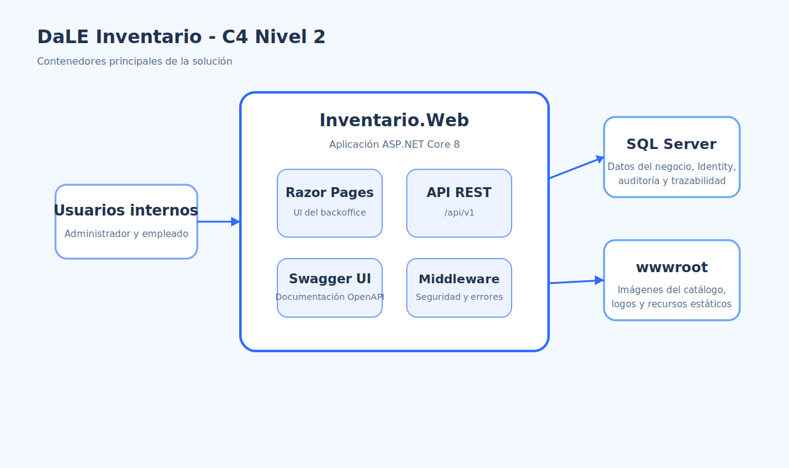

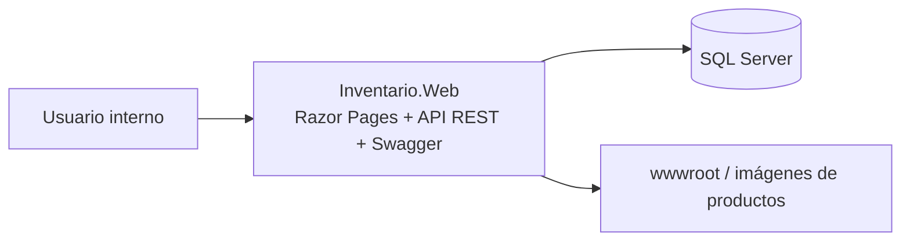

## 3. Nivel 3 - Componentes principales

## 3.1 Dentro de `Inventario.Web`

- `Razor Pages`
  - UI para login, dashboard, productos, ventas, categorías, usuarios y reportes.
- `API Controllers`
  - endpoints REST versionados en `/api/v1`.
- `Middleware`
  - correlation id, manejo global de excepciones, seguridad HTTP, idempotencia y logging.
- `Swagger`
  - documentación y pruebas de la API.
- `Exports/Pdf`
  - generación de documentos PDF para reportes operativos.

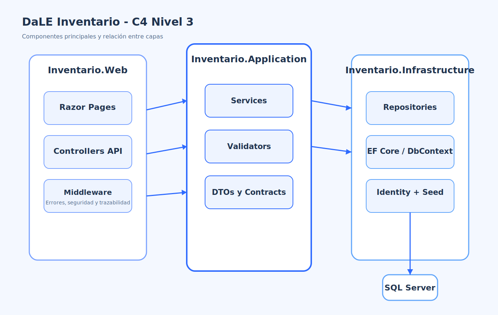

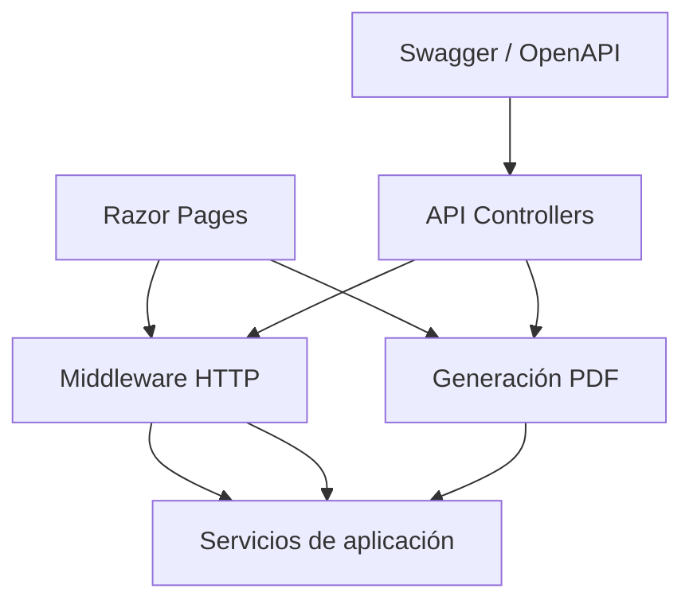

## 3.2 Dentro de `Inventario.Application`

- `Services`
  - coordinan reglas de negocio.
- `Validators`
  - aplican reglas de entrada con FluentValidation.
- `DTOs`
  - definen contratos entre capas.
- `Abstractions`
  - interfaces para servicios y repositorios.

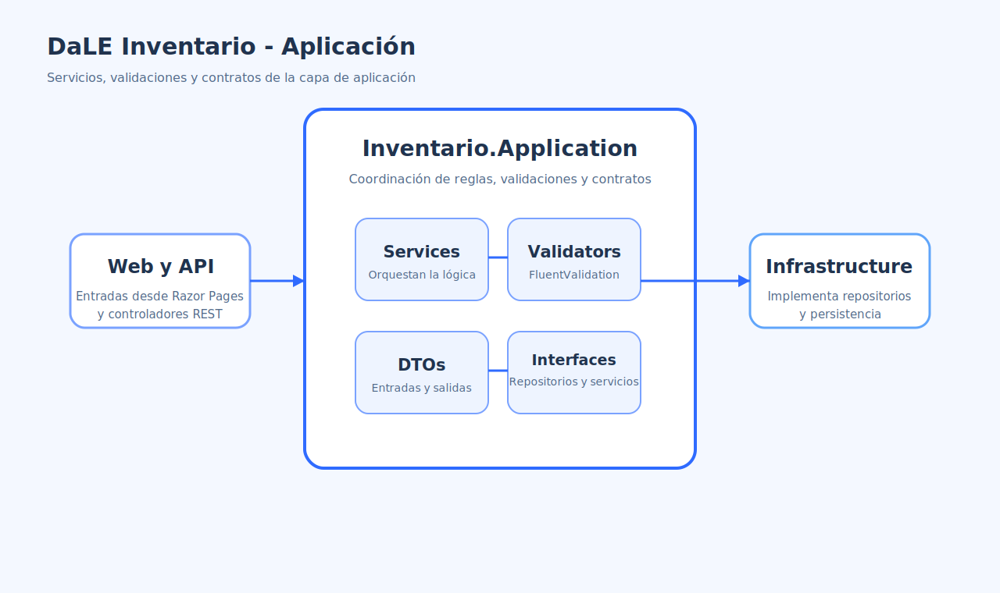

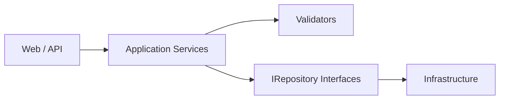

## 3.3 Dentro de `Inventario.Infrastructure`

- `ApplicationDbContext`
  - contexto EF Core.
- `Repositories`
  - acceso a datos de productos, ventas, reportes y categorías.
- `Identity`
  - usuarios, roles y autenticación persistida.
- `DataSeeder`
  - usuarios, categorías, productos demo e imágenes iniciales.

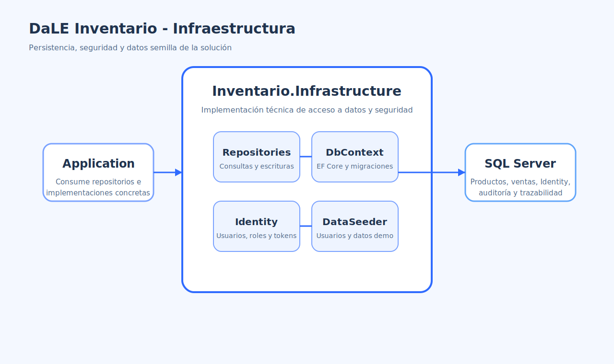

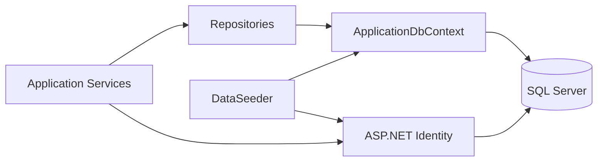

## 4. Nivel 4 - Relación con el código

Las piezas principales del proyecto se distribuyen así:

- `Inventario.Domain`
  - entidades como `Product`, `Sale`, `SaleItem`, `ProductCategory`, `ProductGalleryImage`
- `Inventario.Application`
  - servicios como `ProductService`, `SaleService`, `ReportService`, `ProductCategoryService`
- `Inventario.Infrastructure`
  - `ApplicationDbContext`, repositorios y seeding
- `Inventario.Web`
  - páginas Razor, controladores API, middleware, branding PDF y Swagger

## 5. Flujo principal: registrar una venta

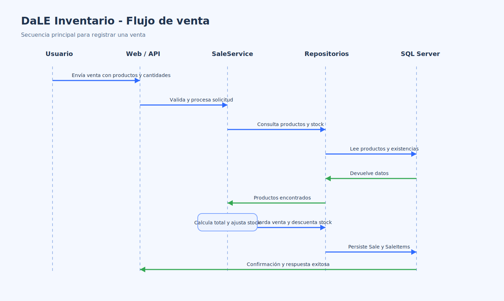

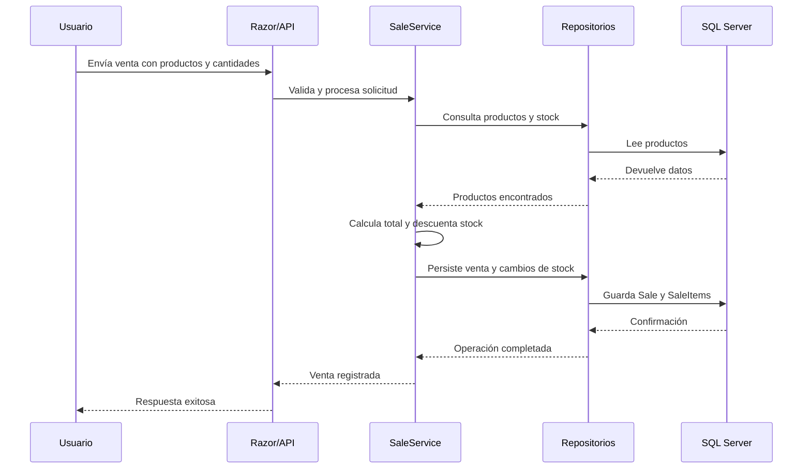

## 6. Flujo principal: generar un PDF

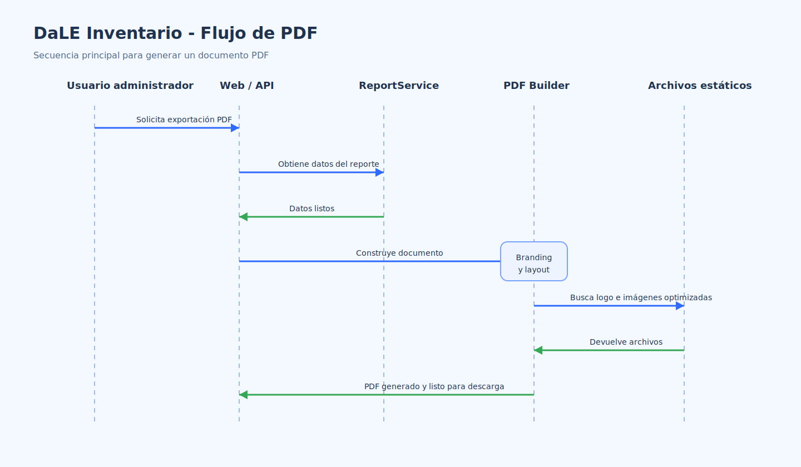

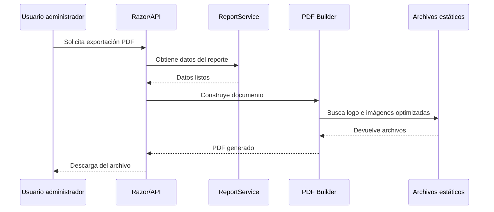

## 7. Decisiones técnicas importantes

##  Decisiones de Arquitectura

| Decisión | Motivo |
|----------|--------|
| Separación en capas (`Domain`, `Application`, `Infrastructure`, `Web`) | Permite una organización clara de responsabilidades, facilitando el mantenimiento y la evolución del sistema |
| Uso de Razor Pages para el backoffice | Agiliza el desarrollo de interfaces internas con una estructura simple y productiva |
| Implementación de API REST versionada | Facilita la integración con otros sistemas, pruebas controladas y crecimiento futuro |
| Autenticación con Identity + JWT | Permite diferenciar la seguridad entre la aplicación web y los consumidores de la API |
| Uso de EF Core con SQL Server | Proporciona una integración sólida con .NET y simplifica la gestión de migraciones |
| Almacenamiento de rutas de imágenes en lugar de blobs en base de datos | Reduce la complejidad y mejora el rendimiento al servir archivos |
| Validaciones con FluentValidation | Centraliza las reglas de negocio de entrada con mayor claridad y mantenibilidad |
| Manejo global de excepciones | Garantiza uniformidad en el manejo de errores y mejora la trazabilidad del sistema |

