# Manual de usuario de DALE Inventario

## 1. Qué es DALE Inventario

DALE significa `Dashboard de Logística e Existencias`.

DALE Inventario es un sistema para controlar productos, ventas, stock bajo y usuarios internos. Está pensado para trabajo operativo diario.

Con este sistema puedes:

- consultar productos
- revisar detalle de cada producto con imágenes
- registrar ventas
- ver alertas de stock bajo
- descargar reportes
- administrar categorías, usuarios y auditoría si tienes permisos de administrador

## 2. Cómo ingresar al sistema

1. Abre el navegador.
2. Ingresa a la dirección que te compartió el responsable técnico.
3. En la pantalla de acceso escribe tu usuario y contraseña.
4. Pulsa el botón para iniciar sesión.

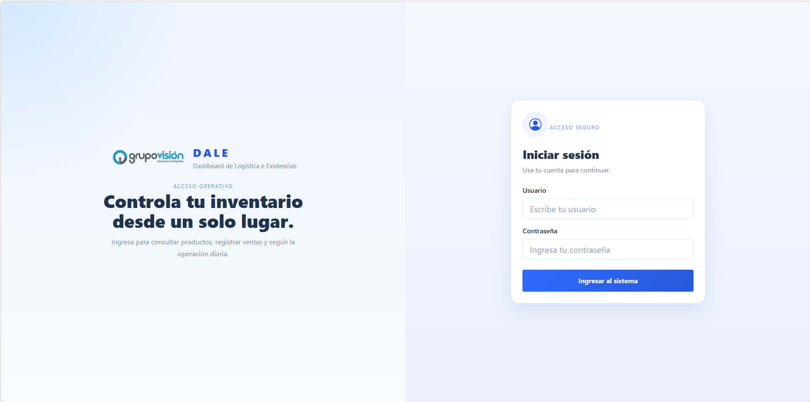

Usuarios de prueba del sistema:
- Rol Sistema :  Usuario  / Contraseña
- Administrador: `admin` / `Admin123*`
- Empleado: `empleado` / `Empleado123*`

## 3. Qué diferencia hay entre administrador y empleado

### Administrador

Puede:

- ver el dashboard completo
- crear y editar productos
- administrar categorías
- administrar usuarios
- editar nombre visible, correo y foto de perfil de los usuarios
- entrar a auditoría
- descargar exportaciones administrativas

### Empleado

Puede:

- consultar productos
- ver detalle de productos
- registrar ventas
- revisar reportes operativos permitidos

No puede entrar a pantallas administrativas.

## 4. Pantalla principal

Después de iniciar sesión verás el dashboard.

Ahí encontrarás:

- resumen general del sistema
- productos con stock bajo
- accesos rápidos
- exportaciones disponibles según tu rol

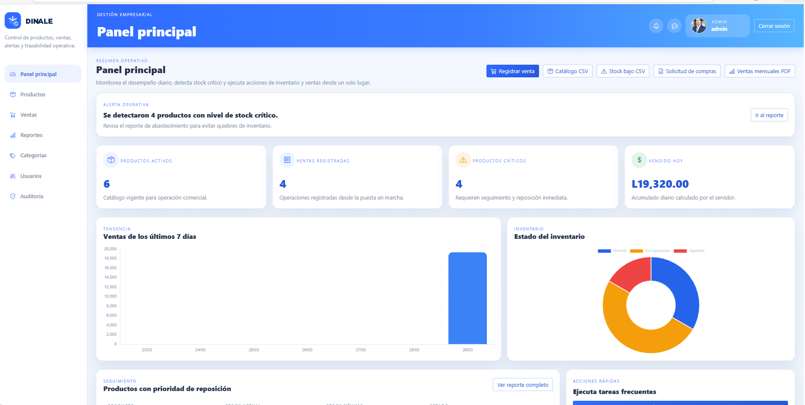

## 5. Módulo de productos

## 5.1 Listado

En el listado de productos puedes:

- buscar por nombre, categoría, marca o descripción
- filtrar por categoría
- filtrar por marca
- filtrar por estado de stock
- ordenar resultados
- abrir el detalle de cada producto

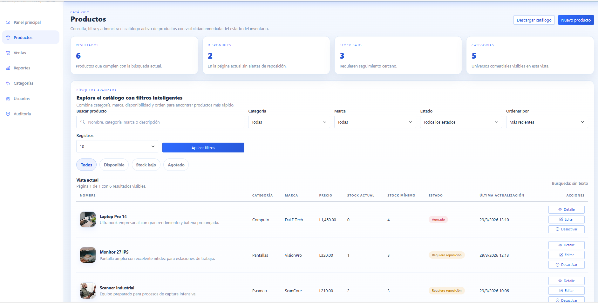

## 5.2 Crear un producto

Si eres administrador:

1. Entra a `Productos`.
2. Pulsa `Nuevo producto`.
3. Completa nombre, categoría, marca, descripciones, precio y stock.
4. Carga una imagen principal.
5. Si quieres, agrega imágenes de galería.
6. Guarda el producto.

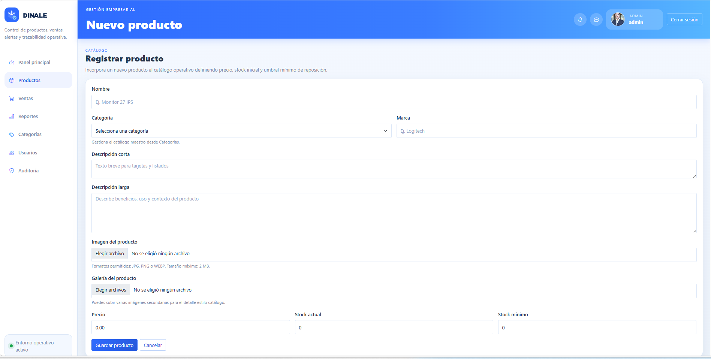

## 5.3 Editar un producto

Si eres administrador puedes:

- cambiar datos del producto
- reemplazar la imagen principal
- quitar la imagen principal
- agregar imágenes nuevas a la galería
- cambiar el orden de la galería
- quitar imágenes de la galería

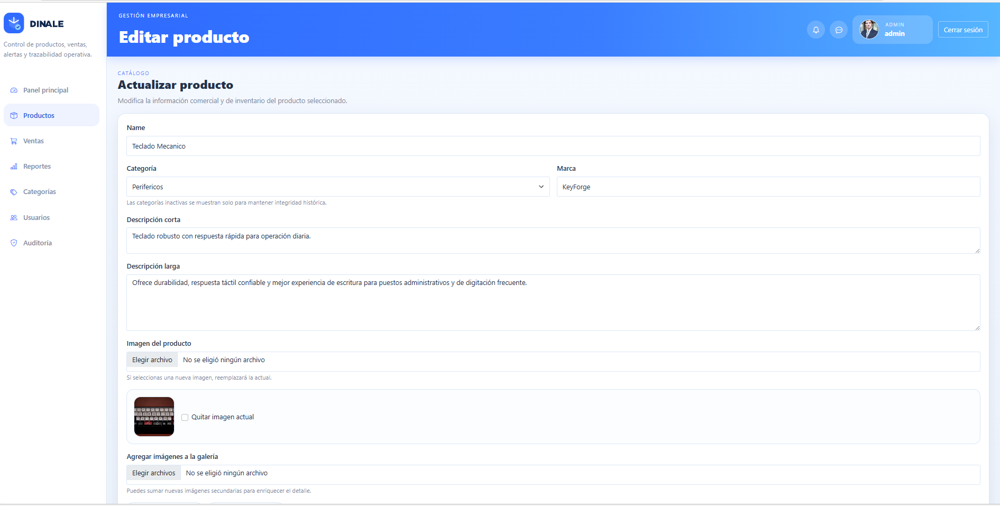

## 5.4 Ver detalle de producto

El detalle del producto muestra:

- imagen principal
- galería de imágenes
- nombre
- categoría
- marca
- descripción
- precio
- stock actual
- stock mínimo
- estado operativo
- productos relacionados
- productos más vendidos

También puedes ampliar la imagen principal para verla mejor.

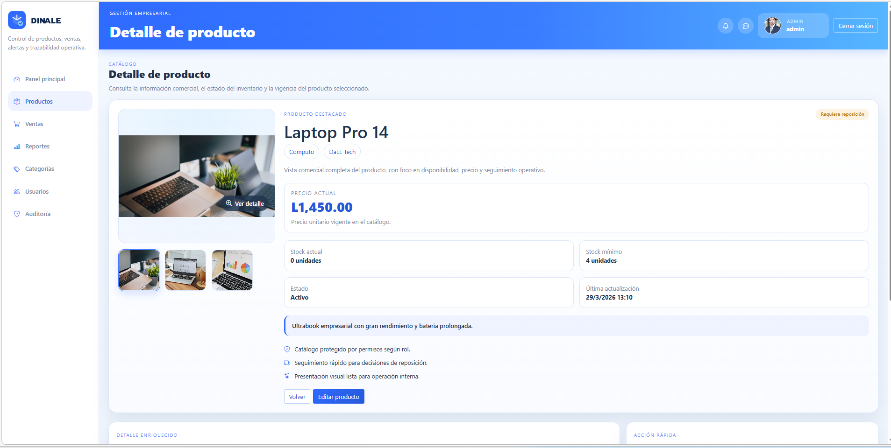

## 6. Categorías

Si eres administrador puedes administrar el catálogo maestro de categorías.

Desde ahí puedes:

- crear categorías nuevas
- activar o desactivar categorías

Las categorías ayudan a mantener el catálogo ordenado y a mejorar búsquedas y filtros.

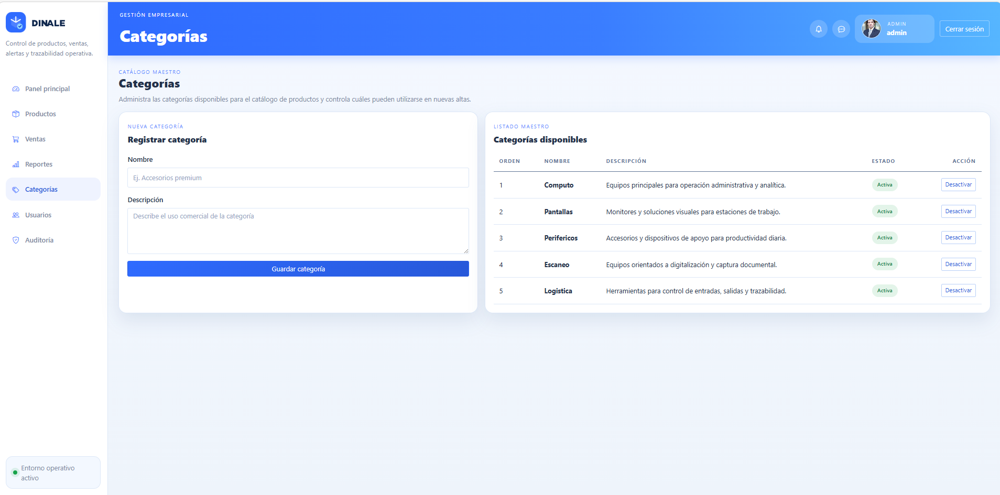

## 7. Ventas

En el módulo de ventas puedes registrar una operación con uno o varios productos.

Pasos:

1. Entra a `Ventas`.
2. Usa el botón `Agregar producto` para incorporar cada artículo a la venta.
3. Define cantidades.
4. Revisa el total.
5. Guarda la venta.

Importante:

- el sistema valida stock disponible
- no permite vender más de lo que existe
- el descuento de stock se hace automáticamente

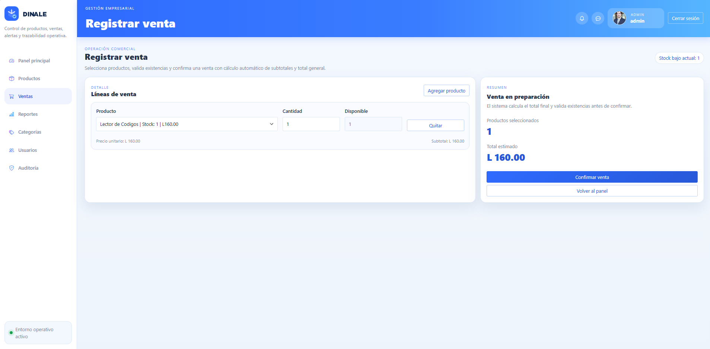

## 8. Stock bajo

El reporte de stock bajo muestra los productos que necesitan reposición.

Sirve para:

- detectar productos en riesgo
- planificar compras
- descargar un reporte
- preparar una solicitud de compra antes de exportarla en PDF

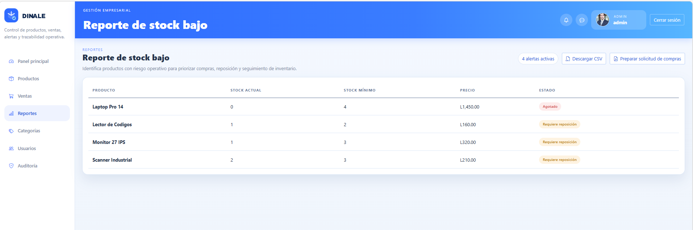

## 8.1 Preparar solicitud de compras

Si eres administrador, antes de generar el PDF puedes revisar una pantalla previa donde se muestran los productos críticos y la cantidad sugerida de compra.

En esa pantalla puedes:

- revisar stock actual y stock mínimo
- ajustar manualmente la cantidad que deseas comprar
- generar el PDF final solo con las cantidades que definiste

Este paso ayuda a que la solicitud refleje mejor la compra real que deseas realizar.

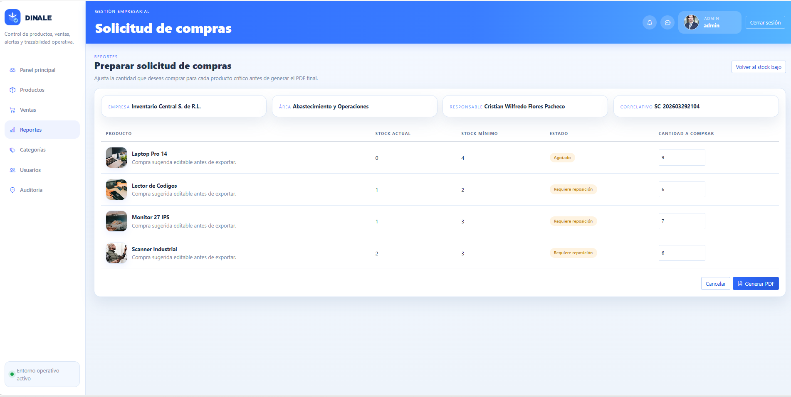

## 9. Reportes y exportaciones

El sistema incluye exportaciones en distintos formatos.

Dependiendo de tus permisos, podrás ver opciones como:

- catálogo de productos en CSV
- reporte de stock bajo en CSV
- solicitud de compra en PDF
- ventas mensuales en PDF

Los PDFs incluyen logo y miniaturas de producto cuando están disponibles.
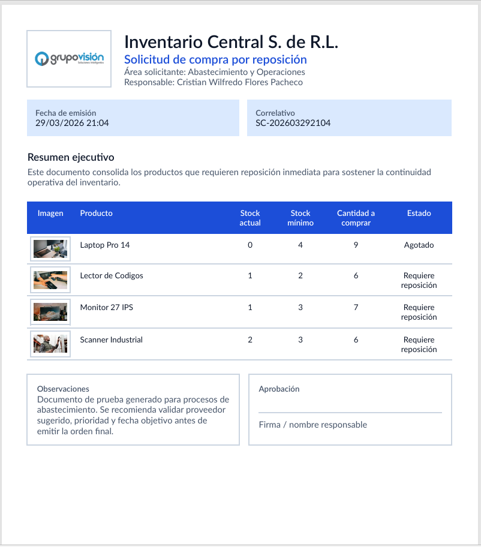
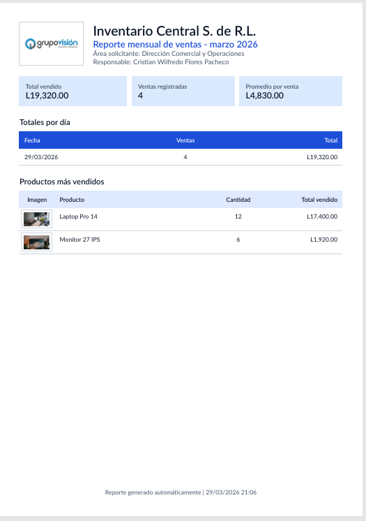

## 10. Usuarios

Si eres administrador, en el módulo de usuarios puedes:

- crear usuarios internos
- cambiar roles
- activar o desactivar cuentas
- editar datos principales del usuario
- cargar o reemplazar foto de perfil

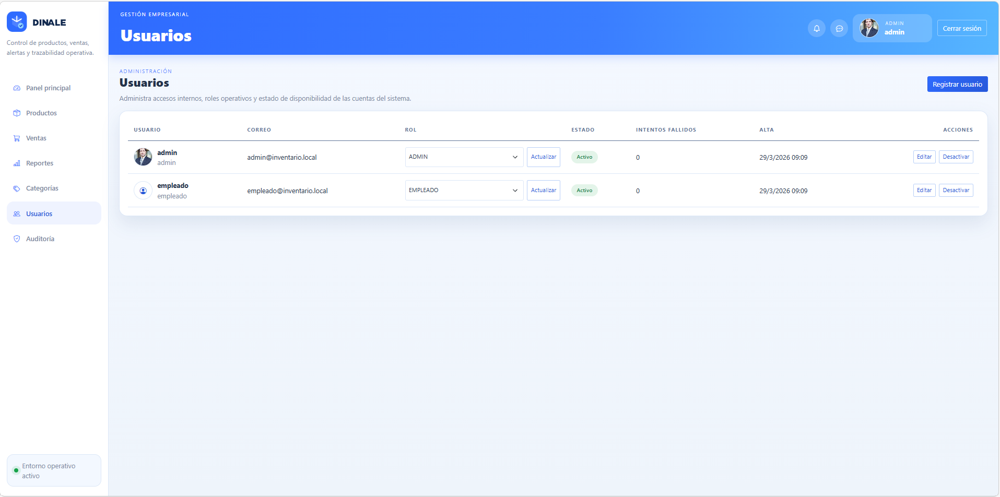

## 11. Auditoría

La auditoría permite revisar eventos importantes del sistema.

Por ejemplo:

- creación o edición de productos
- cambios de usuarios
- ventas registradas
- acciones sensibles

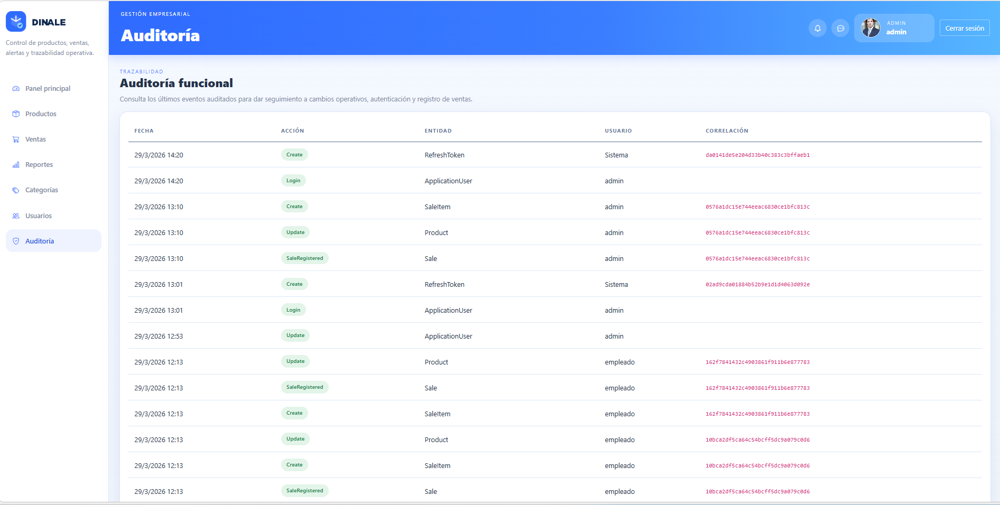

## 11.1 Pruebas desde Swagger

Si el responsable técnico te indica que puedes usar Swagger, ahí podrás probar la API desde el navegador.

Pasos básicos:

1. Entrar a `https://localhost:7049/swagger`.
2. Buscar `POST /api/v1/auth/login`.
3. Usar los usuarios de prueba.
4. Copiar el token si necesitan probar endpoints protegidos.

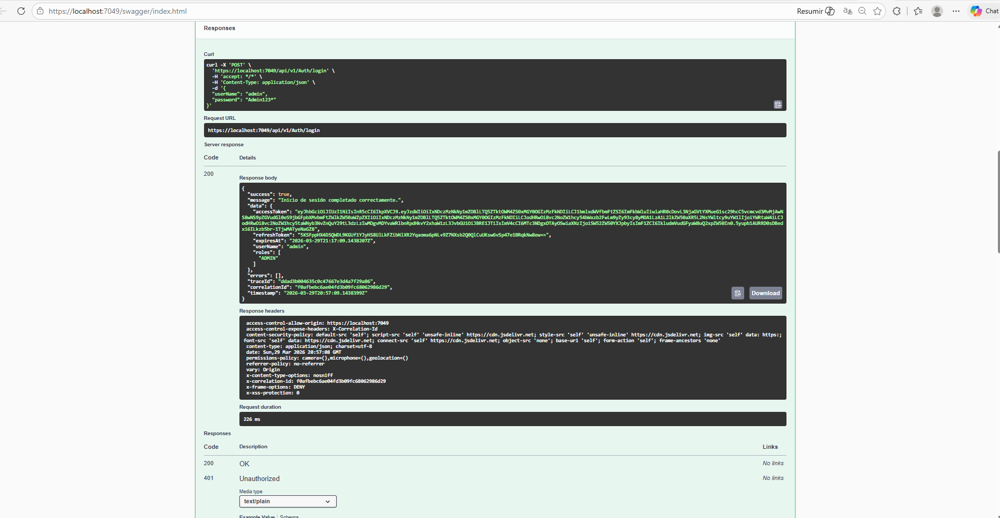

## 12. Qué hacer si aparece un error

### No puedo iniciar sesión

- revisa usuario y contraseña
- confirmar que no haya espacios de más
- si el problema sigue, avisar al administrador

### No veo una pantalla que antes veía

- Puede  ser un tema de permisos
- Tambien puede pasar si tu usuario fue desactivado

### No puedo guardar una venta

- revisar que el producto tenga stock suficiente
- validar que la cantidad sea mayor que cero

### No carga una imagen

- revisar el formato del archivo
- probar con JPG, PNG o WEBP
- si el archivo es muy pesado, intenta con una versión más ligera

## 13. Recomendaciones de uso

- Usar categorías y marcas consistentes para mantener el catálogo ordenado.
- Revisar el dashboard al inicio de la jornada.
- Atender primero los productos con stock bajo.
- Evitar compartir usuarios entre personas.
- Si se va a probar cambios, se sugiere que  primero se usen  usuarios de prueba.

## 14. Cierre de sesión

Cuando se termina  de trabajar:

1. Debemos hacer  clic en la opción de cerrar sesión.
2. Espera a volver a la pantalla de acceso.

Esto es importante si el equipo es compartido.

## 15. Soporte

Si el sistema no responde o encuentran con un problema que no se puede resolver:

- tomar una captura de pantalla
- anotar qué estabas haciendo o realizando en el sistema
- si aparece un mensaje en pantalla, compártirlo tal como se ve
- contactar al responsable del sistema

Con esta información será más fácil poder brindarte el apoyo solicitado.
